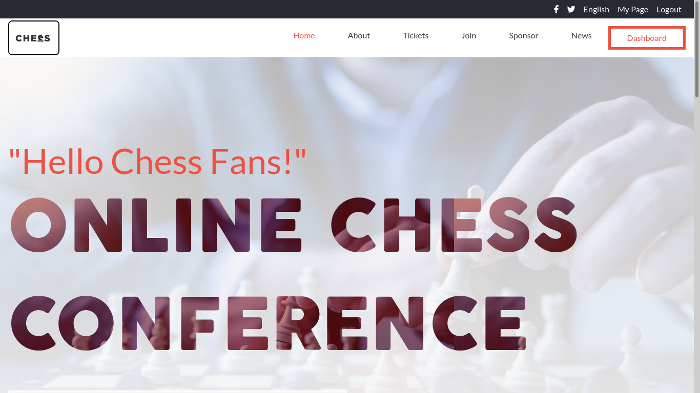

# HTML-CSS-capstone-project-Conference-Page

>This HTML-CSS Capstone Project is about an online chess conference for chess fans and is meant to showcase the skills I have mastered in HTML and CSS. I have also used Bootstrap for CSS Grid and Flexbox, Font Awesome for vector icons in the project, and Jquery, a popular Javascript library.  

## Built With

- HTML
- CSS
- Bootstrap
- Font Awesome
- Jquery

## Live Demo

https://koomekevo.github.io/HTML-CSS-Capstone-Project/index.html

## Presentation Link

https://www.loom.com/share/564e9877a84c47ec92ae91a72f81faf9

## Getting Started

To get a local copy up and running follow these simple example steps.
* Git clone to your computer.
* Open index.html to view the project.

### Prerequisites

Have a HTML5 compatible browser

## Authors

👤 **Kevin Koome**

- GitHub: [@githubhandle](https://github.com/koomekevo)
- Twitter: [@twitterhandle](https://twitter.com/koomekevo)
- LinkedIn: [LinkedIn](https://ke.linkedin.com/in/kevin-koome-aab84186)

## 🤝 Contributing

Contributions, issues, and feature requests are welcome!

Feel free to check the [issues page](../../issues/).

## Show your support

Give a ⭐️ if you like this project!

## Acknowledgments

I have followed the [design](https://www.behance.net/gallery/29845175/CC-Global-Summit-2015) given by [Cindy Shin in Behance](https://www.behance.net/adagio07)

## 📝 License

Shield: [![CC BY 4.0][cc-by-shield]][cc-by]

This work is licensed under a
[Creative Commons Attribution 4.0 International License][cc-by].

[![CC BY 4.0][cc-by-image]][cc-by]

[cc-by]: http://creativecommons.org/licenses/by/4.0/
[cc-by-image]: https://i.creativecommons.org/l/by/4.0/88x31.png
[cc-by-shield]: https://img.shields.io/badge/License-CC%20BY%204.0-lightgrey.svg